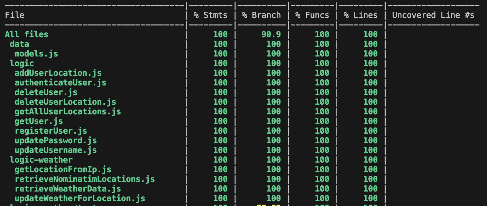

## Nimbux - Your Ultimate Weather Dashboard

### Introduction 

**Nimbux** is an intuitive weather web app that allows the user to track the weather for their favourite locations with ease.

It provides 🌦️ real-time weather updates and 📅 forecasts for the upcoming 7 days, both for the user's 📍 current location and any place in the world. Users can view detailed information such as 🌡️ temperature, 🌧️ precipitation, 💨 wind, 🌤️ sky conditions, 🌅 sunrise and sunset times, and 🌞 total daylight hours — all within a clean and user-friendly dashboard.

Nimbux requires users to 🔐 register and log in to access its core functionalities, such as saving locations and viewing personalized forecasts.

### Use Cases

#### User Management
- **📝 Register**: Users can create an account to start using the app.
- **🔐 Log In**: After registration, users can log in to access their personalized dashboard. Upon login, the weather for their current location is automatically displayed.
- **🚪 Log Out**: Users can log out of their account at any time for security purposes.
- **✏️ Edit Profile**: Users can edit their username and password to update their personal information.
- **❌ Delete Account**: Users can delete their account permanently, removing all stored information.

#### Location and Weather Management
- **➕ Add Locations**: Users can add their favorite locations to track weather updates for those places.
- **❌ Remove Locations**: Users can remove locations they no longer want to track.
- **🔄 Weather Updates**: Weather information is automatically updated for each location, including current conditions and forecasts.
- **🌡️ View Current Weather**: Users can view real-time weather information, including temperature, precipitation, wind speed, and humidity.
- **📅 Weekly Forecast**: Users can access a 7-day weather forecast to plan ahead with details about upcoming weather patterns.
- **🌅 Sunrise & Sunset**: Users can see sunrise and sunset times for each saved location.
- **🌞 Daylight and Sunlight Hours**: Users can track the total amount of daylight and sunlight hours for any given location.

### UI/UX Design

The design of Nimbux was inspired by several existing weather web applications. I aimed to combine features from various apps to create a seamless and intuitive user experience. The goal was to provide a clean, easy-to-navigate interface while ensuring that all key weather information is accessible at a glance.

The logo was created by a friend, who is a UX designer. She also provided the icons used throughout the app, converting them into vector format to ensure crisp, high-quality visuals. Additionally, we worked together to refine the logo, and finalize the color palette, which reflects both the app's friendly and professional character.

## Technical Description 

### Technologies and libraries 

#### Frontend: ⚛️ React, ⚡ Vite, 🎨 Tailwind CSS, 🌼 DaisyUI  
#### Backend: 🌐 Node.js, 🚀 Express  
#### Database: 🗃️ MongoDB, 📦 Mongoose  
#### Authentication: 🔑 JSON Web Token (JWT)  
#### Password Encryption: 🔒 bcrypt  
#### Testing: 🔍 Mocha, 🍵 Chai
#### Charts: 📊 Recharts (used to plot weather data)

### APIs

#### Open Meteo: 🌤️ To retrieve weather data (https://open-meteo.com/)  
#### Nominatim API: 📍 To get location data given location string (https://nominatim.org/)  
#### IP-API: 🌍 To get current location based on IP address (https://ip-api.com/)

### Data Models

#### Location Schema: 📍  
Stores weather data for a specific location.

- **name**: Name of the location (String)  
- **latitude**: Latitude of the location (Number)  
- **longitude**: Longitude of the location (Number)  
- **timeLastUpdated**: Timestamp of the last update (Date)  
- **current**: Current weather conditions (Object)  
- **current_units**: Units for the current weather data (Object)  
- **dailyForecast**: Forecast data for upcoming days (Object)  
- **dailyForecast_units**: Units for the forecast data (Object)

#### User Schema: 👤  
Stores user information and current and favourite locations.

- **username**: Username of the user (String)  
- **email**: Email address (String, unique)  
- **password**: Encrypted password (String)  
- **currentLocation**: Reference to the user's current location (ObjectId, ref to Location)  
- **favLocations**: List of favorite locations (Array of ObjectIds, ref to Location)

### Test Coverage

### 🔮 Future Versions
- **🗑️ Improve Location Deletion Logic**: Currently, deleting a location only removes it from the user's list. In the future, unused locations should also be deleted from the database. 

- **🌦️ Add More Weather Data**: Expand the current weather information with additional variables such as UV Index, total precipitation for the upcoming days, visibility, or air pressure.

- **⚙️ User Preferences for Units**: Allow users to switch between metric and imperial units (e.g., Celsius/Fahrenheit, km/h vs. mph, mm vs. in) based on their preferences.

